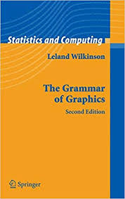

```{r setup, include=FALSE}
knitr::opts_chunk$set(echo = FALSE, size="tiny", fig.align="center")
library(knitr)
library(tidyverse)
library(ggplot2)
library(data.table)
library(kableExtra)
```

## My Journey With R
- 2000: First course, then forgot about it for many years
- 2014: An Environmental Science course refreshed my memory
- 2016: Lost (deleted?) an Excel file at work, faced a minor crisis, immediately turned back to R
- 2017: Rgronomists began
- ggplot2, tidyverse, RMarkdown, R Projects

## The Grammar of Graphics
<center></center>  
- Framework for describing component of a graphic and "layering" the structure  
- Components include the data, scales, and coordinate system, among other

## More Reading  
- Technical Information: <https://byrneslab.net/classes/biol607/readings/wickham_layered-grammar.pdf>
- Cheat Sheet: <https://rstudio.com/wp-content/uploads/2015/03/ggplot2-cheatsheet.pdf>

## Getting Started
1. Arrange your dataframe to long format (e.g. using *melt()*)
<center>[https://datacarpentry.org/R-ecology-lesson/03-dplyr.html](gather_data_R.png)</center>

## Getting Started
1. Arrange your data to long format
2. Define your aesthetics: define x, y, and any grouping you want to do

## Getting Started
1. Arrange your data to long format
2. Define your aesthetics
3. Indicate how your data should be displayed: geom_bar, geom_line, geom_point, etc.

## Getting Started
1. Arrange your data to long format
2. Define your aesthetics
3. Indicate how your data should be displayed
4. Layer on additional display qualities and design features

```{r cars, include=FALSE}
#---Load your dataset and prepare---------------------------------------
crops <- read.csv(file = "USDA_1920to2018_Statewide_PlantedCropAcres_Processed_E20190821.csv", header = T)
crops <- spread(crops, key = "Year", value = "value")

  # Sort the dataset by 2018 acreage and subset the top ten land uses
  crops_select <- crops[order(crops$`2018`, decreasing = T), ]
  crops_select <- crops_select[1:10, ]
```

## 1. Prepare your data

```{r Prepare data 1, echo=TRUE}
kable(head(crops_select[, 1:5]), format = "html") %>%
  kable_styling(bootstrap_options = "striped", full_width = T)
```

## 1. Prepare your data

```{r Prepare data 2, echo=TRUE}
#---Prepare dataframe in long format------------------------------------
crops_melt <- melt(crops_select, id.vars = "variable")
names(crops_melt) <- c("Crop", "Year", "Acres")
crops_melt$Year <- as.numeric(as.character(crops_melt$Year))
kable(crops_melt, format = "html") %>%
  kable_styling(bootstrap_options = "striped", full_width = T, font_size = 10)
```

## 2. Define your aesthetics

```{r Define aesthetics 1a, echo=TRUE}
plot1 <- ggplot(crops_melt)
```

## 2. Define your aesthetics

```{r Define aesthetics 1b, echo=FALSE}
plot1
```

## 2. Define your aesthetics

```{r Define aesthetics 2a, echo=TRUE}
plot2 <- ggplot(crops_melt, 
                aes(x = Year, y = Acres, group = Crop, color = Crop))
```

## 2. Define your aesthetics

```{r Define aesthetics 2b, echo=FALSE}
plot2
```

## 3. Indicate how your data should be displayed

```{r Display data 1a, echo=TRUE}
plot3 <- 
  ggplot(crops_melt, 
         aes(x = Year, y = Acres, group = Crop, color = Crop)) + 
  geom_line(size = 1, na.rm = T)
```

## 3. Indicate how your data should be displayed

```{r Display data 1b, echo=FALSE}
plot3
```

## 4. Layer on additional display qualities and design features

```{r Layer 1a, echo=TRUE}
plot4 <- 
ggplot(crops_melt, 
       aes(x = Year, y = Acres, group = Crop, color = Crop)) + 
  geom_line(size = 1, na.rm = T) + 
  labs(title = "Iowa Crop Acres, 1920-2018") + 
  scale_x_continuous(breaks = seq(1920, 2018, 10), 
                     labels = seq(1920, 2018, 10)) + 
  scale_y_continuous(breaks = seq(0, 14000000, 2000000), 
                     labels = format(seq(0, 14000000, 2000000), 
                                     big.mark = ",", scientific = F)) + 
  theme_bw()
```

## 4. Layer on additional display qualities and design features

```{r Layer 1b, echo=FALSE}
plot4
```

## 4. Layer on additional display qualities and design features
Interesting options:  
- Faceting  
- Using other fonts  
- Exploring other themes  

## Hands-On
Create a bar graph to compare different crops' acreages in 2018. Try a theme other than *theme_bw()*
